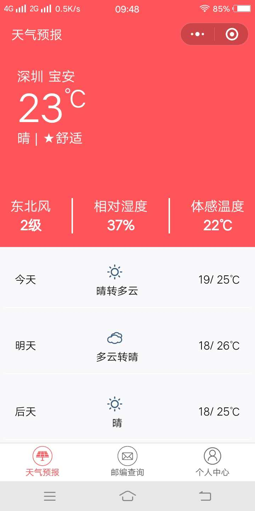
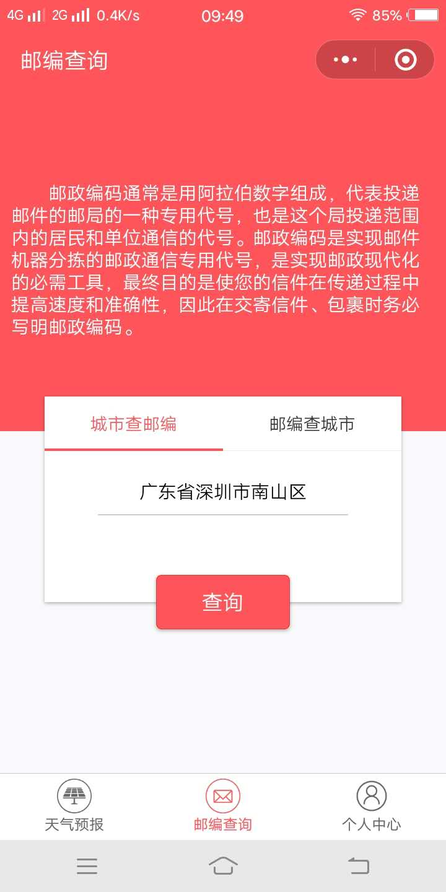
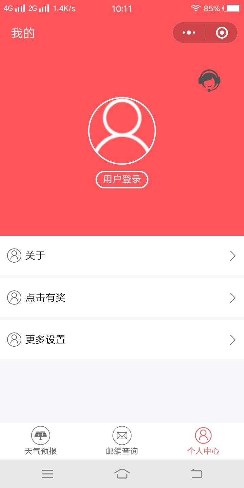
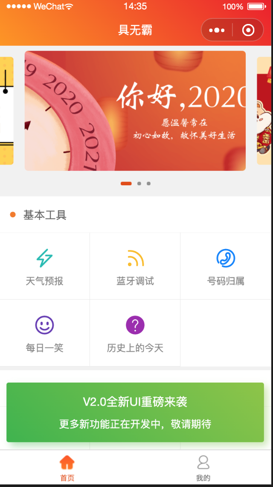

### 从零开发一款小程序项目——生活全能通！主要学习小程序的整个开发流程、学习小程序组件和API的使用。本项目仅用于学习专用！
  ---

### 一、微信小程序开发相关资料：

* [微信公众平台:](https://mp.weixin.qq.com/)
    * 开发小程序或公众号需要先到这里注册
* [小程序官方文档:](https://mp.weixin.qq.com/debug/wxadoc/introduction/index.html?t=2018313)
    * 微信小程序开发离不了官方文档。
* [小程序官方开发文档:](https://mp.weixin.qq.com/debug/wxadoc/dev/index.html?t=20171117)
    * 微信小程序开发离不了官方开发文档。

### 二、主要效果图
#### 天气预报：

#### 邮件查询：

#### 个人中心：

#### 新版v2.0.0已上线，首页整合1.0功能：

### 三、欢迎体验
* 目前小程序已经上线，整个开发流程也算是大概了解和尝试过了。最后贴出小程序码，欢迎体验！
* 

### 四、致谢
* 本项目用的第三方api接口有变化，在2.0版我已经弃用1.0的接口，改用其他的了，对我们来说接口只是数据但不影响学习！
* 由于时间问题，只能晚上挤时间实在不易，后期将会在此项目基础上不断优化，提高用户体验，与此提高我个人的开发能力！
* 最近建了公众号，欢迎大家关注，一起学习Android、小程序、跨平台开发~
* 

